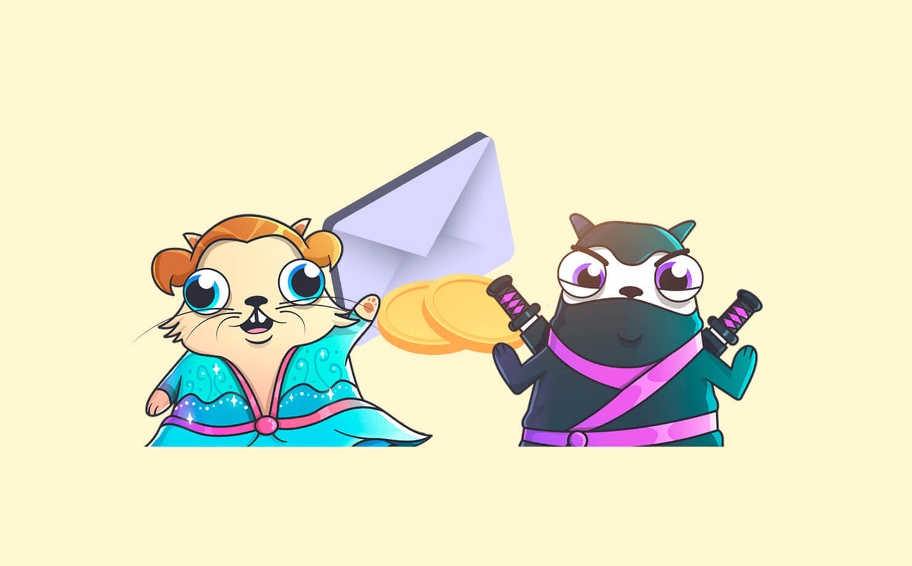

### What is an NFT?

It’s known as a non-fungible token, meaning that each token is unique, one-of-one. It cannot be traded and is exclusive to the owner. To answer the follow-up question that’s already in your mind, this token isn’t physical and is considered a digital asset. In simpler terms, each NFT is made up of unique lines of code stored in a block chain. Essentially, blockchain is an online database which has multiple uses but is commonly used as a ledger of Bitcoin transactions.  

### How are NFTs acquired?

NFTs can be purchased using Ethereum: cryptocurrency. Remember the days of collecting baseball cards or vintage dolls? This is the exact same concept – except digitally. You can list and sell art, music, and everything in between via online marketplaces. Believe it or not, original tweets, memes, video games, and gifs are just a few things that have been sold and are currently still holding strong in the NFT world.  

### How do NFTs actually work?

You need to lock and load your crypto wallet, which you can connect and track, if you’re interested in purchasing NFTs as everything operates digitally. 
Due to the increasing hype, there are now ‘drops’ that not only build anticipation but can make bidding a very interesting experience for all eager and willing participants.

### How can I create my own NFT?

It’s quite simple – create something, mint it (this is how your creation is now living on the Ethereum blockchain), and register to sell it on the various marketplaces. There’s a cost associated with the minting and selling process that can fluctuate based on the platform you choose to use. You can also write clauses into your NFTs, including but not limited to royalties if copies are being sold.

### What impact do NFTs have in the world of finance?

When we think about how technology continues to revamp and shift the world we live in – it definitely has its’ benefits. For example, let’s use luxury handbags. There are businesses that literally take a design and create a replica for a lower price point. On the flip side, there are businesses that will try deceiving consumers into believing that their version is the original.

In this world of NFTs, there cannot be more than one original. Blockchain technology serves as a record-keeping system that assigns unique lines of code; remember? Since this is the case, you can sell the ‘replicas,’ but can’t hold the title (or the monetary value) of being the first and original. Not only does this promote exclusivity, but it also completely erases the issue of making an investment without being 100% confident that a physical, tangible product is authentic. While many have the ability to do a quick search and view an NFT – you would have the ownership of this digital asset and the opportunity to generate more income because of it.

### Are NFTs really worth the hype and why are they worth so much?

There’s no straight answer here – it honestly depends on your personal comfort level and long-term investment goals. Just like anything else, this is truly a hobby or a topic of interest that may or may not be expensive to the general public. Investing in any capacity is a risk, whether it’s stocks, options, or mutual funds. While these have been around for longer and generated solid data history, anything can happen in the world of investing. Since the pandemic, we all may be reluctant to admit that there’s a huge influx of time spent online. We had already incorporated scrolling through social media, leisure internet surfing, and reading into our routines, but that’s increased because of our extended homestays.

However, the fluid mobility that we were accustomed to (and potentially took for granted) was restricted at the beginning of the pandemic as travel limitations were in place. There were no opportunities to attend live auctions, museums, or in-person events. With NFTs, it doesn’t matter where you’re located in the world. There’s no need to make any travel accommodations to buy what you want thanks to the world wide web. This places a huge advantage within the NFT realm, as everyone has the equal opportunity to bid for whatever’s up for grabs as long as you have the cryptocurrency available.

### Should one consider investing in NFTs?

They’ve generated quite the buzz lately, with many tokens selling for millions of dollars. Just like with any other investment be sure to take your time and explore before diving in. As mentioned before, think about original paintings or collector cards. This uses the same concept but uses digital storage so you can’t hack or compromise it due to blockchain coding. Physical items can endure weathering and just plain old wear and tear that comes with aging. You’ll never have to worry about your NFT getting lost during a move, bumped, bruised, or destroyed by environmental elements.

While NFTs are creating quite the buzz now, they’re not necessarily new in concept. In 2017, CryptoKitties was a game that allowed users to create, breed, and sell digital cats. Here in 2021 you can buy and sell everything under the sun using blockchain technology.

The possibilities for the NFT market to go through the traditional cycle of surging, collapsing, and stabilizing shows it fits right in with the developing world of investments.

