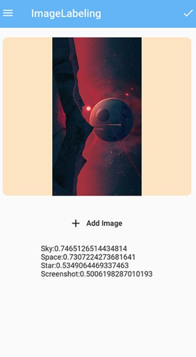

### What is Machine Learning?

Machine learning is a branch of artificial intelligence (AI) focused on building applications that learn from data and improve their accuracy over time without being programmed to do so.

In flutter with help of ML Kit we can integrate our app with various smart features such as:
- Text Recognition
- Face Detection
- Image Labeling
- Landmark recognition
- Barcode scanning

To enable the use of ML Kit we need to connect the app with the firebase. We will be using two dependencies ```firebase_ml_vision: ^0.9.7```
for ML Kit and ```image_picker: ^0.6.7+11``` to get the image using a gallery or camera.

**Let's Start**

**Configure your app**

- Add the dependencies in your pubspec.yaml
```
firebase_ml_vision: ^0.9.7
image_picker: ^0.6.7+11
```
- Edit your app/build.gradle
```
dependencies {
    implementation "org.jetbrains.kotlin:kotlin-stdlib-jdk7:$kotlin_version"
    api 'com.google.firebase:firebase-ml-vision-image-label-model:17.0.2'
}
```
- Edit your AndroidManifest.xml file
```
<meta-data
    android:name="com.google.mlkit.vision.DEPENDENCIES"
    android:value="ica" />
```

**Creating UserImagePicker Class:**

```ImagePicker``` is one of the most frequently used functionality when we try to get the user images as an input to perform authentication, profile image upload, etc. This widget provides us the flexibility to chose images from our phone gallery or using a phone camera. Here also we are trying to achieve the same.

- Initializing File and ImagePicker objects
```
File _pickedImage;
ImagePicker picker = ImagePicker();
```

- ```pickImage``` function with default ```ImageSource```

```
void _pickImage(ImageSource imageSource) async {
  final pickedImageFile = await picker.getImage(
    source: imageSource,
  );
```

- Creating the Image Container

This container with rounded corners shows the image picked by the user. If there is no image then ```Please Add Image``` text will be displayed in the center.

```
Padding(
  padding: const EdgeInsets.all(18.0),
  child: ClipRRect(
    borderRadius: BorderRadius.circular(10),
    child: Container(
      color: Colors.orangeAccent.withOpacity(0.3),
      width: MediaQuery.of(context).size.width,
      height: 300,
      child: _pickedImage != null
          ? Image(
              image: FileImage(_pickedImage),
            )
          : Center(
              child: Text("Please Add Image"),
            ),
    ),
  ),
),
```

- Creating a FlatButton.icon

On pressing FlatButton.icon a AlertDialog will appear that will contain two options to choose from the image source.

```
FlatButton.icon(
  onPressed: () {
    showDialog(
        context: context,
        builder: (_) {
          return AlertDialog(
            title: Text(
              "Complete your action using..",
            ),
            actions: [
              FlatButton(
                onPressed: () {
                  Navigator.of(context).pop();
                },
                child: Text(
                  "Cancel",
                ),
              ),
            ],
            content: Container(
              height: 120,
              child: Column(
                children: [
                  ListTile(
                    leading: Icon(Icons.camera),
                    title: Text(
                      "Camera",
                    ),
                    onTap: () {
                      _pickImage(ImageSource.camera);
                      Navigator.of(context).pop();
                    },
                  ),
                  Divider(
                    height: 1,
                    color: Colors.black,
                  ),
                  ListTile(
                    leading: Icon(Icons.image),
                    title: Text(
                      "Gallery",
                    ),
                    onTap: () {
                      _pickImage(ImageSource.gallery);
                      Navigator.of(context).pop();
                    },
                  ),
                ],
              ),
            ),
          );
        });
  },
  icon: Icon(Icons.add),
  label: Text(
    'Add Image',
  ),
)
```
Your ```UserImagePicker.dart``` file will look like this:

```
import 'dart:io';

import 'package:flutter/material.dart';
import 'package:image_picker/image_picker.dart';

class UserImagePicker extends StatefulWidget {
  UserImagePicker(
    this.imagePickFn,
  );

  final void Function(File pickedImage) imagePickFn;

  @override
  _UserImagePickerState createState() => _UserImagePickerState();
}

class _UserImagePickerState extends State<UserImagePicker> {
  File _pickedImage;
  ImagePicker picker = ImagePicker();

  void _pickImage(ImageSource imageSource) async {
    final pickedImageFile = await picker.getImage(
      source: imageSource,
    );

    setState(() {
      _pickedImage = File(pickedImageFile.path);
    });
    widget.imagePickFn(File(pickedImageFile.path));
  }

  @override
  Widget build(BuildContext context) {
    return Column(
      children: <Widget>[
        Padding(
          padding: const EdgeInsets.all(18.0),
          child: ClipRRect(
            borderRadius: BorderRadius.circular(10),
            child: Container(
              color: Colors.orangeAccent.withOpacity(0.3),
              width: MediaQuery.of(context).size.width,
              height: 300,
              child: _pickedImage != null
                  ? Image(
                      image: FileImage(_pickedImage),
                    )
                  : Center(
                      child: Text("Please Add Image"),
                    ),
            ),
          ),
        ),
        SizedBox(
          height: 10,
        ),
        FlatButton.icon(
          onPressed: () {
            showDialog(
                context: context,
                builder: (_) {
                  return AlertDialog(
                    title: Text(
                      "Complete your action using..",
                    ),
                    actions: [
                      FlatButton(
                        onPressed: () {
                          Navigator.of(context).pop();
                        },
                        child: Text(
                          "Cancel",
                        ),
                      ),
                    ],
                    content: Container(
                      height: 120,
                      child: Column(
                        children: [
                          ListTile(
                            leading: Icon(Icons.camera),
                            title: Text(
                              "Camera",
                            ),
                            onTap: () {
                              _pickImage(ImageSource.camera);
                              Navigator.of(context).pop();
                            },
                          ),
                          Divider(
                            height: 1,
                            color: Colors.black,
                          ),
                          ListTile(
                            leading: Icon(Icons.image),
                            title: Text(
                              "Gallery",
                            ),
                            onTap: () {
                              _pickImage(ImageSource.gallery);
                              Navigator.of(context).pop();
                            },
                          ),
                        ],
                      ),
                    ),
                  );
                });
          },
          icon: Icon(Icons.add),
          label: Text(
            'Add Image',
          ),
        )
      ],
    );
  }
}

```

**Creating a imageLabeler function**

- Creating objects for ```FirebaseVisionImage``` and ```ImageLabeler```

```
FirebaseVisionImage myImage = FirebaseVisionImage.fromFile(_userImageFile);
ImageLabeler labeler = FirebaseVision.instance.imageLabeler();
```

FirebaseVisionImage is an object that represents an image object used for both on-device and cloud API detectors.imagLabeler() method creates an on-device instance of ImageLabeler .

**Processing image**
```
_imageLabels = await labeler.processImage(myImage);
```
ImageLabeler provides us ```processImage()``` method that takes an FirebaseVisionImage object. Here _imageLables is a list of ImageLabel.

- Storing the labels in the result variable.

```
for (ImageLabel imageLabel in _imageLabels) {
  setState(() {
    result = result +
        imageLabel.text +
        ":" +
        imageLabel.confidence.toString() +
        "\n";
  });
}
```

- ```processImageLabels()``` code

```
processImageLabels() async {
  FirebaseVisionImage myImage = FirebaseVisionImage.fromFile(_userImageFile);
  ImageLabeler labeler = FirebaseVision.instance.imageLabeler();
  _imageLabels = await labeler.processImage(myImage);
  result = "";
  for (ImageLabel imageLabel in _imageLabels) {
    setState(() {
      result = result +
          imageLabel.text +
          ":" +
          imageLabel.confidence.toString() +
          "\n";
    });
  }
}
```



**Resources for help**
- [firebase ml vision](https://pub.dev/packages/firebase_ml_vision)
- [image picker](https://pub.dev/packages/image_picker)


***Thanks for Reading .If I got something wrong? Let me know in the comments. I would love to improve.***
