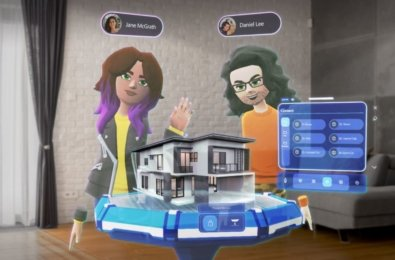

### What is Microsoft Mesh?

Microsoft Mesh is a Mixed Reality platform intended to make collaboration and app creation easier. The solution is designed to work with various virtual and augmented reality headsets, allowing users to collaborate in both physical and virtual locations more effectively.  

### Why we need it?

During 2020, we recognised that although physical collaboration wasn’t convenient when it came to things like time management and travel. However, many business leaders and staff members struggled to achieve the same productivity without a similar “face to face” environment.  

Microsoft Mesh promises to give us the best of both worlds (virtual and real). Within a holographic space, users can interact with different people and content in a shared and safe environment.  

Though, at first, Microsoft notes that collaborating employees will appear as virtual avatars to their colleagues, the eventual vision is to offer holoportation technology. This would mean that users can appear as themselves in the Mesh space, and “teleport” between settings. Microsoft Mesh aims to enable users in interacting more effectively with others, wherever your colleagues are.  

### How Microsoft Mesh Will Transform Collaboration 

We’ve already seen evidence of Microsoft’s ability to transform the collaboration environment with Microsoft Teams. However, as valuable as file sharing, project management, and video conferencing are, these tools don’t fully replicate the in-office team environment.  

Microsoft Mesh aims to deliver all the immersive creativity and intimate interactions of real-life collaboration, within the safe and scalable virtual world. Microsoft Mesh opens the door to the future of XR collaboration platforms, where participants can interact in a visual-first space.  

Within Microsoft Mesh, companies will be able to build and access apps that allow users to work together on holographic or 3D projects in real-time. You can share ideas with team members half way around the globe, and sensors can track your movements so that you can interact with digital content, as though you were handling it in real life.  

Microsoft is already beginning to demonstrate how Microsoft Mesh can change online meetings and collaborative events. During Ignite, the company demonstrated their holoportation strategy, which will allow people to present lifelike digital holograms of themselves to people anywhere on the planet.  

Microsoft Mesh will pave the way for: 

- Animated avatars: Animated avatars are Microsoft’s first step towards photo-realistic holoportation. These tools will enable employees to engage in remote collaboration with 2D and 3D content, as well as dynamic avatar representations of their peers. Tools will be able to access things like Azure Active Directory to help team members find each other
- Interactive meetings: Building on Microsoft’s reputation with meetings in Microsoft Teams, interactive virtual meetings through Mesh will offer far more complex experiences, with 3D content that users can interact with in real-time and hand-tracking technology
- In app integrations: Developers on the Microsoft Mesh platform will access Microsoft functionality and potentially even third-party apps for additional functionality. For instance, you could grab a document from Microsoft Word and pull it into a meeting so you and your team members can flip through the pages together 
- Project immersion: Compared to the collaboration tools available today, Microsoft Mesh could offer much higher degrees of immersion. Organisations will be able to create mixed–reality meeting spaces and place employees in the same room from around the globe. You’ll also be able to work together on projects and 3D blueprints without having to waste any materials or resources

### So what does the Future looks like?

Despite the chatter around Microsoft Mesh has been growing in volume for a while now, we’re still in the early stages of its development. Microsoft has huge plans for the future, revolving around holoportation and unique expanded reality experiments. Like many of Microsoft’s biggest developments, Mesh is the product of a dream for better collaboration and person-to-person interactions. 

***More on this: ***
[Microsoft wins $22 bn US army contract for augmented reality gear](https://news.yahoo.com/microsoft-wins-pentagon-contract-augmented-203349070.html)

