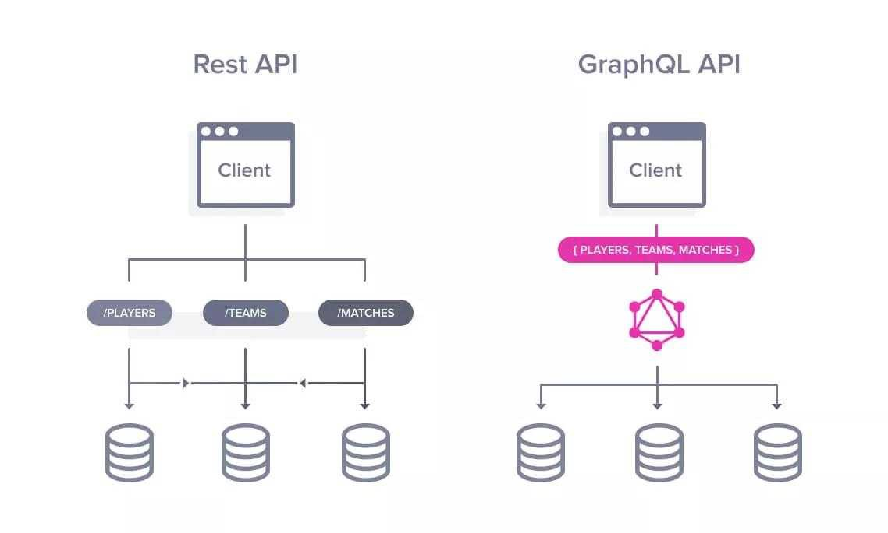
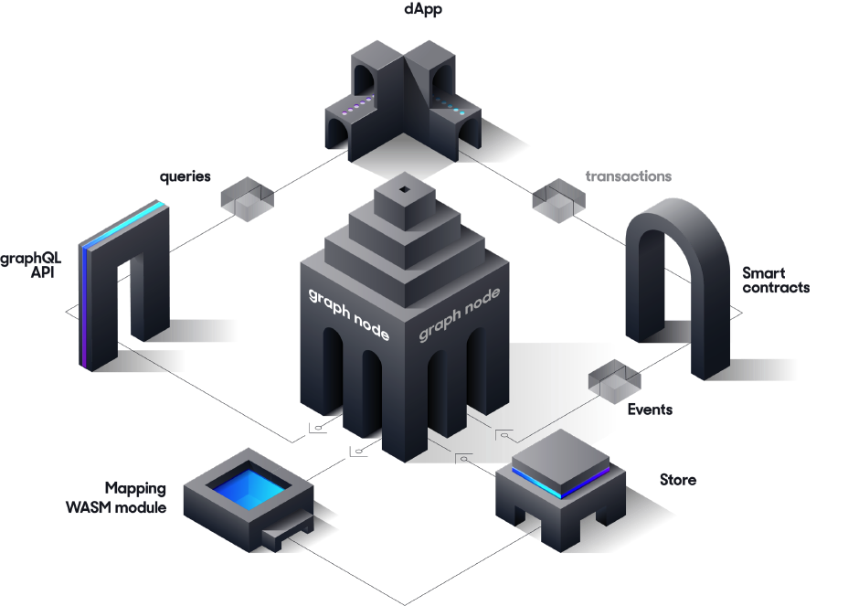
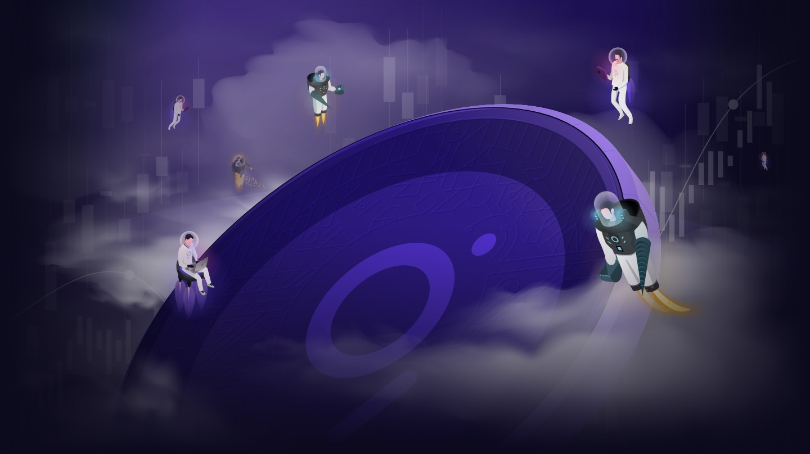

The Web3 revolution is just getting started, eliminating the irregularities of the centralized Web 2.0.

The main difference between Web2 and Web3 is decentralization. Web3 builders re-design the internet itself from the ground level, giving back the ownership to its participants. So that, one corporation cannot have control and make important decisions for us. The Graph has become an essential part of developing Decentralized apps by making life easier for Web3 developers.

### Web 3.0 without theGraph

One of the main hurdles of developing a decentralized application (dApp) is the complexity of querying and using data from a blockchain.

Let us imagine, a developer is building a betting game based on Web3. He wants to display the total games lost/won and update it whenever someone plays again. It is not so difficult to do in the traditional way. Let us say, he wants to display the amounts of bets lost/won only for a specific player. Well, we are out of luck. In this case, he needs to deploy a new contract that stores those values and fetches them . One project aiming to change this situation is The Graph. It makes dApps development easier for the developer, by indexing and making subgraphs.

### What is Graph?

The Graph is an indexing protocol with decentralized abilities. It is an integral part of Web3, considering that it is a vital addition needed to provide seamless data for decentralized applications (DApps).

To understand Graph protocol, we have to understand indexing, the main idea behind The Graph. Indexing reduces the time required to find a particular piece of information.

It is like an index in a book. To find a concept, instead of going through the whole book page by page, we can find it much quicker in the index. Which is sorted alphabetically and contains a referral to the actual page.

Database indexes do the same thing in computer science, cutting the search time by indexing the whole database.

### The Google of Blockchains

As Web3 use cases grow, it’s important to remember what separates Web3 from the centralized web, so that we don’t repeat the mistakes of the past. Dapps must run on a fully decentralized protocol. Any points of centralization can and will be abused to lock people in and gain market advantage.

The Graph comes into play as an enabler of decentralized internet applications that will be completely facilitated by public infrastructure.

To build a decentralized application the indexing layer must be also decentralized. You can have a decentralized blockchain, but if a user is interacting with it through a centralized service, you’ve now reintroduced centralization. You now have other companies making decisions around the state of the information and what information is true.

According to Yaniv Tal, cofounder of The Graph, “the nodes running The Graph are all decentralized, the smart contracts they run are also decentralized, and the indexers are decentralized”. Yet, its technology has underpinned a wide swath of crypto applications, from the most popular to up-and-comers.

Imagine you’re building Google today — the Graph is doing a similar thing. It’s gathering all this public information on all these blockchains. The difference between Google and the Graph is The Graph is doing it all open source and decentralized.

### Conclusion

The Graph protocol’s ability to create a global grid of public information, helps eliminate the need for projects to develop and operate proprietary indexing servers. Using The Graph saves time and money, typically spent on engineering and hardware resources. So developers can provide next level decentralized applications with amazing abilities that will surpass the usual expectations that users have.

### Resources for learning

[theGraph](https://thegraph.com/docs)

