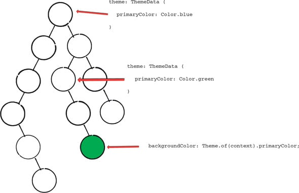
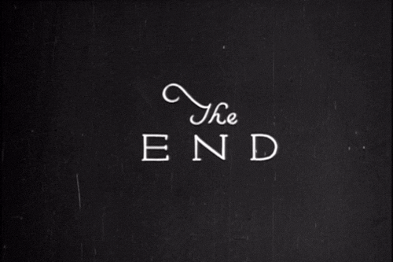

### BuildContext

Flutter also has a concept called BuildContext that is critical to the creation of applications. It has everything related to tracking all widgets in the tree, including their locations in the tree. ThemeData updates the sub-widgets along the widget tree when you change your theme.

### How BuildContext Works?

During the build process, each widget element receives a parameter named BuildContext, a reference to the widget component's position in the widget tree. You don't have to manage build context yourself because the build framework itself is called. A concrete example is the Theme.of method, a static method in the Theme class. Theme.of, when called with a BuildContext argument, provides information about that widget tree place within the widget tree. 

Build context retrieves the Theme information for this point in the tree and returns it as primaryColor in the Theme class. You can do this in your application's color widgets by calling Theme.of(buildContext).primaryColor.

There is a build context for every widget. Therefore, if you have multiple themes spread across your tree, getting the theme of one widget will produce a different result than getting the theme of another widget. If this is the case, you will be assigned the closest parent.

Flutter uses the build context to tell it where and how to build specific widgets. Flutter, for example, uses build context to display modals and routes. If you want to view a new modal, Flutter needs to know where it should be added to the tree. A modal will be created in BuildContext by migrating to a new method. What you need to know about build context is that it refers to the widget's position within the widget tree, rather than the widget itself.

