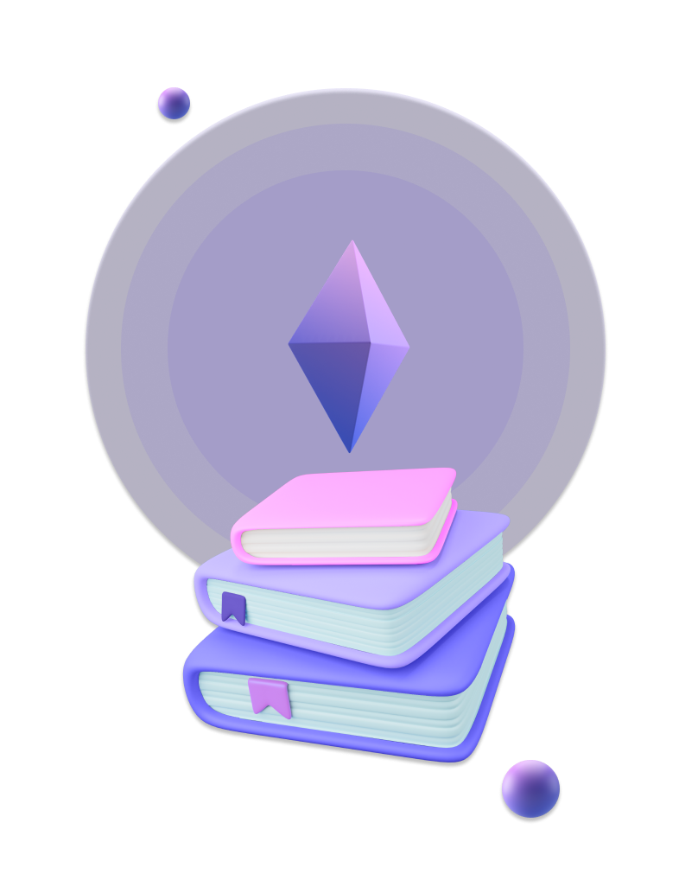

### Web3 dapps and Smart Contracts

Just like normal web development, there are two aspects to consider.Blockchain has a similar system between web3 and smart contract creators.

Web3 developers will build separate applications and will create browser functionality that will connect digital wallets and send tasks to or from blockhain.

They will use modern frameworks such as React or View, as well as a web library that will run JavaScript.

The developers of Smart Contract will create a code that works in blockchain. They will use a specific programming language such as Solidity, spending more time on text and terminal editor.

### What blockchain you should choose?

The first thing that you have to do is to decide what blockchain you will use.Different blockchains use different programming languages and ways of storing data on chain.

The two main blockchains that are good to be considered are Ethereum and Solana.Ethereum it become more expensive to use and build on,but the same code can be used on alternative blockchains such as Binance Smart Chain,Avalanche,Polygon,Phantom,etc.

If you don`t have a very specific reason to buid on Solana,you should focus on Solidity which is a smart contract language for Ethereum and many other Ethereum compatible blockchains.

### What you should learn first?

The best option is to start learning JavaScript for the beginning,few people will choose also to start learning Solidity first.

Some of the reasons you should learn JavaScript first is because some of the migrations scripts and web3 stuff is written in JavaScript.You could bulid mobile apps,websites and desktop applications.

JavaScript is everywhere and you can use it and outside of the blockchain space,on whichever industry you go into.

Solidity is designed based on programming languages like C++, Python, and JavaScript, so it uses similar language structures found in these languages, most likely to make it easy for developer adoption. If you are a JavaScript or C++ developer, this will look familiar to you.

### What tools you`ll need as a blockchain developer?

The first tool to use will be remix.ethereum.org .It is a integrated development enviroment (IDE) where you can build your smart contract.

Once you get used with Remix,you can move to an offline development enviroment like Hardhat or Truffle.

### Resources for learning

Some free resources where you can learn Solidity enviroment :

[CryptoZombies](https://cryptozombies.io/)

[Capture the Ether](https://capturetheether.com/)

[Solidity Documentation](https://docs.soliditylang.org/en/v0.8.14/)

- Youtube also has a lot of free channels from where you can learn Solidty.

### Finding Jobs

Blockchain is consistently one of the highest paying programming fields, where developers earn between $100,000 and $175,000 on average per year.

Websites where you can find a job in the blockchain industry:

- [Linkedin](https://www.linkedin.com/)
- [Web3 Jobs](https://web3.career/)
- [CryptoJobList](https://cryptojobslist.com/)
- [Cryptocurrencyjobs](https://cryptocurrencyjobs.co/)
- [Crypto.jobs](https://crypto.jobs/)

