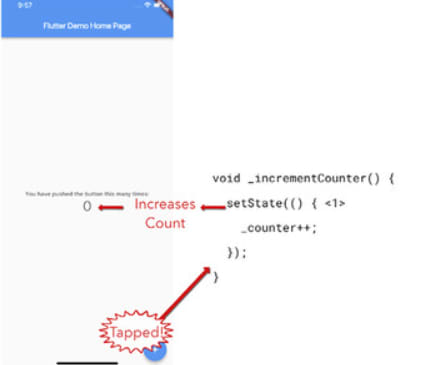
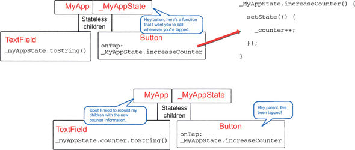

### setState()

After build and createState, setState is the third key Flutter method you need to know. Available only for state entities. The method requires a callback, VoidCallback.

In this example, the state entity is the _MyHomePageState widget tool, its child elements interact with the province, and it depends on the state. It calls a method from _MyHomePageState when you press the button. Using this method, _MyHomePageState.build is called again and widget elements whose configurations have changed are repainted.

SetState does not support asynchronous programs, but that is all it does. Flutter should not repaint anything before any async work is completed, because it does not know what data to display until the setState method is invoked. It is best to wait until the image is ready for display before calling setState on a GIF received from a GIF API on the Internet.

